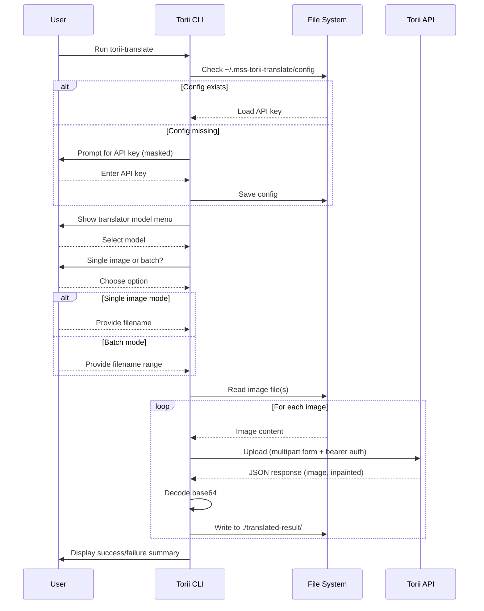

# ⛩ Torii Translate

A Rust CLI tool that sends manga/comic images to the [Torii Translate](https://toriitranslate.com) API and saves the translated results locally. Fully interactive — prompts you through configuration and file selection before making any API calls.

## Requirements

- [Rust](https://www.rust-lang.org/tools/install) 1.75 or later
- A Torii Translate API key

## Build

```bash
git clone <repo>
cd torii-translate
cargo build --release
```

The compiled binary will be at `target/release/torii-translate`.

## Install

**Option A — install to `~/.cargo/bin` (recommended):**

```bash
cargo install --path .
```

This puts `torii-translate` on your `PATH` so you can run it from anywhere.

**Option B — copy the binary manually:**

```bash
cargo build --release
cp target/release/torii-translate /usr/local/bin/
```

## Usage

Navigate to the directory that contains your manga/comic images, then run:

```bash
torii-translate
```

The app will guide you through four steps:

### Step 1 — API Key

On first run you will be prompted for your Torii Translate API key. The key is saved to `~/.mss-torii-translate/config` and will not be asked again on subsequent runs.

```text
  API Key
  › No API key found. Enter your Torii Translate key to continue.

  API key: ••••••••••••••••••••
  ✓ API key saved to ~/.mss-torii-translate/config
```

To change the key, edit or delete `~/.mss-torii-translate/config`.

### Step 2 — Translator Model

Use the arrow keys to select a translation model, then press Enter.

```text
  Translator
  Model
  > Gemini 2.5 Flash Lite  (1 credit)
    Deepseek               (1 credit)
    Grok 4.1 Fast          (1 credit)
    Kimi K2.5              (2 credits)
    GPT 5.1                (2+ credits)
    Gemini 3 Flash         (2+ credits)
```

| Model | API value | Credits |
|---|---|---|
| Gemini 2.5 Flash Lite | `gemini-2.5-flash` | 1 |
| Deepseek | `deepseek` | 1 |
| Grok 4.1 Fast | `grok-4-fast` | 1 |
| Kimi K2.5 | `kimi-k2` | 2 |
| GPT 5.1 | `gpt-5` | 2+ |
| Gemini 3 Flash | `gemini-3-flash` | 2+ |

### Step 3 — Single or Batch

```text
  Input
  Mode
  > ❯  Single image
    ❯  Batch  (range of images)
```

### Step 4 — File Selection

**Single image** — type the filename. The current directory name is shown in the prompt so you can confirm you are in the right place.

```text
  Filename in [chapter-01]: 005.png
```

**Batch** — type the start and end filenames. The app derives the full list by incrementing the zero-padded numeric stem.

```text
  Start filename in [chapter-01]: 001.png
  End filename: 005.png
```

This calls the API for `001.png`, `002.png`, `003.png`, `004.png`, and `005.png`.

### Output

Translated images are written to `./translated-result/` inside the directory you ran the command from, keeping the original filenames.

```text
chapter-01/
├── 001.png
├── 002.png
└── translated-result/
    ├── 001.png
    └── 002.png
```

## Flow



## Supported Image Formats

`png`, `jpg`/`jpeg`, `webp`, `gif`

## Development

```bash
cargo build      # debug build
cargo check      # fast type-check without linking
cargo run        # run directly without installing
```
