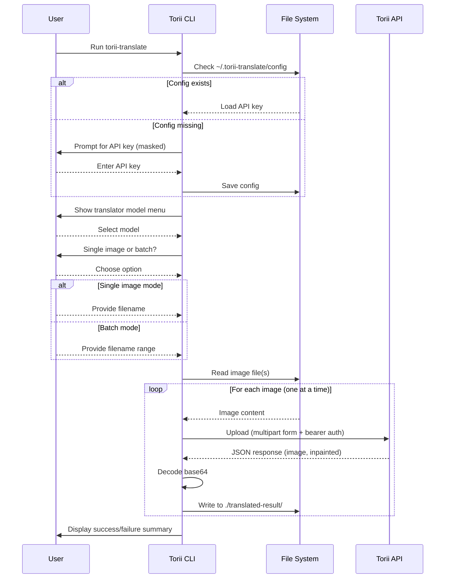

# ⛩ Torii Translate

A Rust CLI tool that sends manga/comic images to the [Torii Translate](https://toriitranslate.com) API and saves the translated results locally. Fully interactive — prompts you through configuration and file selection before making any API calls.

## Requirements

- [Rust](https://www.rust-lang.org/tools/install) 1.75 or later
- A Torii Translate API key

## Install

### 1. Install Rust

If you don't have Rust installed, get it via `rustup` (the official installer):

```bash
curl --proto '=https' --tlsv1.2 -sSf https://sh.rustup.rs | sh
```

Follow the on-screen prompts, then restart your terminal (or run `source ~/.cargo/env`) so that `cargo` is on your `PATH`.

Verify the installation:

```bash
cargo --version
```

### 2. Clone the repository

```bash
git clone <repo>
cd torii-translate
```

### 3. Build and install the binary

**Option A — install to `~/.cargo/bin` (recommended):**

```bash
cargo install --path .
```

This compiles the binary in release mode and places it in `~/.cargo/bin/`, which `rustup` adds to your `PATH` automatically. You can then run `torii-translate` from any directory.

**Option B — copy the binary manually:**

```bash
cargo build --release
cp target/release/torii-translate /usr/local/bin/
```

Use this if you prefer to control where the binary lives (e.g. on a system-wide path like `/usr/local/bin/`).

### 4. Verify

```bash
torii-translate --help
```

## Usage

Navigate to the directory that contains your manga/comic images, then run:

```bash
torii-translate
```

The app will guide you through four steps:

### Step 1 — API Key

On first run you will be prompted for your Torii Translate API key. The key is saved to `~/.torii-translate/config` and will not be asked again on subsequent runs.

```text
  API Key
  › No API key found. Enter your Torii Translate key to continue.

  API key: ••••••••••••••••••••
  ✓ API key saved to ~/.torii-translate/config
```

To change the key, edit `~/.torii-translate/config` directly:

```ini
api_key=your-key-here
last_translator=gemini-2.5-flash
last_mode=single
```

The `last_translator` and `last_mode` values are written automatically after each run and pre-select your previous choices the next time you start the app.

### Step 2 — Translator Model

Use the arrow keys to select a translation model, then press Enter.

```text
  Translator
  Model
  > Gemini 2.5 Flash Lite  (1 credit)
    Deepseek               (1 credit)
    Grok 4.1 Fast          (1 credit)
    Kimi K2.5              (2 credits)
    GPT 5.1                (2+ credits)
    Gemini 3 Flash         (2+ credits)
```

| Model | API value | Credits |
|---|---|---|
| Gemini 2.5 Flash Lite | `gemini-2.5-flash` | 1 |
| Deepseek | `deepseek` | 1 |
| Grok 4.1 Fast | `grok-4-fast` | 1 |
| Kimi K2.5 | `kimi-k2` | 2 |
| GPT 5.1 | `gpt-5` | 2+ |
| Gemini 3 Flash | `gemini-3-flash` | 2+ |

### Step 3 — Single or Batch

```text
  Input
  Mode
  > ❯  Single image
    ❯  Batch  (range of images)
```

### Step 4 — File Selection

**Single image** — type the filename. The current directory name is shown in the prompt so you can confirm you are in the right place.

```text
  Filename in [chapter-01]: 005.png
```

**Batch** — type the start and end filenames. The app derives the full list by incrementing the zero-padded numeric stem.

```text
  Start filename in [chapter-01]: 001.png
  End filename: 005.png
```

This calls the API for `001.png`, `002.png`, `003.png`, `004.png`, and `005.png`.

Images are translated **one at a time**, in order. Each file shows an animated spinner with a live elapsed timer while it uploads. Press **Ctrl+C** at any time to stop cleanly after the current file finishes.

### Output

Translated images are written to `./translated-result/` inside the directory you ran the command from, keeping the original filenames.

```text
chapter-01/
├── 001.png
├── 002.png
└── translated-result/
    ├── 001.png
    └── 002.png
```

## Flow



## API Reference

Full API documentation: **https://toriitranslate.com/api**

This tool uses the **Translate** endpoint:

| Field | Value |
|---|---|
| Endpoint | `POST https://api.toriitranslate.com/api/v2/upload` |
| Auth | `Authorization: Bearer <api-key>` |
| Credits | 1+ per request (varies by model) |

**Request parameters:**

| Parameter | Required | Description |
|---|---|---|
| `file` | Yes | Image file (PNG, JPG, WEBP, GIF) |
| `target_lang` | Yes | Target language (e.g. `en`) |
| `translator` | Yes | Model to use (see translator table above) |
| `font` | Yes | Font name (e.g. `wildwords`) |
| `text_align` | No | Text alignment (`auto`, `left`, `center`, `right`) |
| `stroke_disabled` | No | Disable text stroke (`true`/`false`) |
| `min_font_size` | No | Minimum font size in px |
| `custom_prompt` | No | Custom translation instructions (max 500 chars) |
| `context` | No | Additional context for the translation (max 10,000 chars) |

**Response:** JSON with `image` (translated, base64 data URI) and `inpainted` (background-only, base64 data URI).

The API also offers an **OCR endpoint** (`POST /api/ocr`, 1 credit) and an **Inpaint endpoint** (`POST /api/inpaint`, 0.02 credits) — see the full docs for details.

## Supported Image Formats

`png`, `jpg`/`jpeg`, `webp`, `gif`

## Development

```bash
cargo build      # debug build
cargo check      # fast type-check without linking
cargo run        # run directly without installing
```
